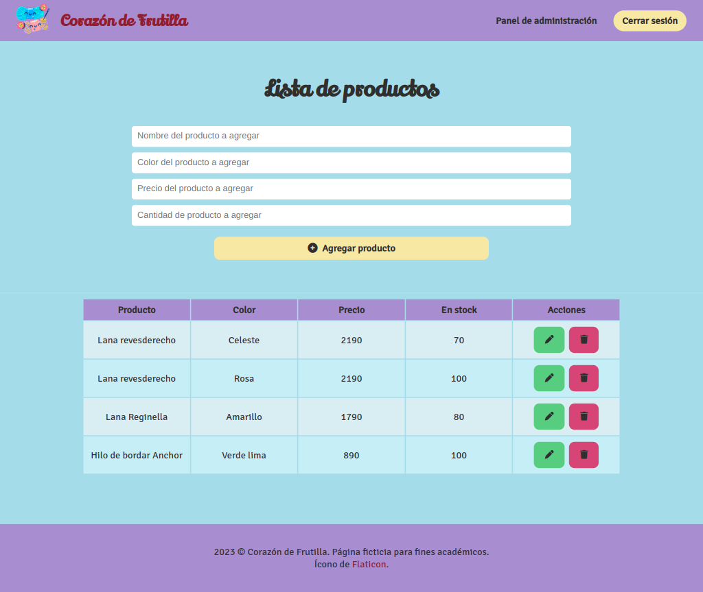

# "Corazón de Frutilla" CRUD

## Description

This project is a simple product management CRUD app for a ficticious business called "Corazón de Frutilla", an online store that sells knitting and crocheting supplies. Users can add, delete and edit information about products. It was developed using HTML, CSS, JavaScript, DOM manipulation and local storage to store data.

## Visuals



## Starting 🚀

These instructions will help you to obtain a copy of the project and execute it on your local machine for developing and testing purposes.

### Prerequisites 📋

No additional installation is required to execute this project, you just need an updated web browser.

### Installation 🔧

1. Clone this repository on your local machine.

```bash
git clone https://github.com/aolivos15/P2-CRUD.git
```

1. Navigate to the directory of the project.

```bash
cd P2-CRUD
```

1. Open the file `index.html` in your web browser.

## Running tests ⚙️

This project does not include automated tests. However, you can manually test all features of the product management app.

### End-to-end tests 🔩

You can verify that products are correctly created, updated and deleted.

### Coding style tests ⌨️

Be sure to keep a clean and well-structured code following the best practices for HTML, CSS and JavaScript.

## Deployment 📦

You can implement this project in a web server or use it locally without the need for additional deployment steps.

## Built with 🛠️

This project was built using the following tools:

* HTML - Website structure
* CSS - Styles
* JavaScript - Logic and funcionality of the product inventory
* DOM - Handling of the document object model tree
* Local Storage - Storing data in the browser

## Contribute 🖇️

This is an open source project and contributions are welcome. You can help by improving the design, by adding new features or by correcting mistakes. Feel free to send your pull requests!

## License 📄

This project is under the MIT license. Check the [LICENSE](LICENSE) file for more details.

## Acknowledgments 🎁

This readme file has been developed using the following project as a reference:

* [template-readme-es](https://github.com/brayandiazc/template-readme) - created by [Brayan Diaz C](https://github.com/brayandiazc)

---
⌨ ️with ❤️ by [Andrea Olivos](https://github.com/aolivos15) 😊
